# Internal

> Overview of the code base of baldrick-doc-ts

This document has been generated automatically by [baldrick-doc-ts](https://github.com/flarebyte/baldrick-doc-ts)

## Diagram of the dependencies

```mermaid
classDiagram
class `client.ts`{
  +runClient()
}
class `commanding-action.ts`{
  +cmdGenerateTypedocAction()
  +cmdParseAction()
}
class `commanding-data.ts`
class `commanding-helper.ts`{
  -capitalize()
  -decapitalize()
  +toCamelCase()
  +toCommanderOption()
  +splitDocBase()
}
class `commanding.ts`
class `csv-internal.ts`{
  -getKeywords()
  -fromFunctionInfo()
  -sortedByFunction()
  +toCsvFonctions()
}
class `env-helper.ts`{
  +getPackageName()
}
class `feature-helper.ts`{
  -isFeature()
  -toFeature()
  +toFeatures()
}
class `fp-diagram.ts`{
  -functionInfoToDiagram()
  -importInfoToDiagrams()
  -importInfoToRelationships()
  +toFunctionalProgrammingDiagram()
  -functionToMermaid()
  -entityToMermaid()
  -relationshipToMermaid()
  -noDuplicateFunctionDiagram()
  -mergeFunctionDiagrams()
  +mergeSourceDiagrams()
  -noDuplicateRelationshipDiagram()
  +toFunctionalProgrammingMermaid()
}
class `fp-vocabulary.ts`{
  -extractWordsFromName()
  -asVocabulary()
  -extractSource()
  +toProjectVocabulary()
  -convertToNgram()
  -byCountDesc()
  +toProjectVocabularyRank()
}
class `index.ts`
class `io-sfx.ts`{
  -readTypedocJson()
  -writeApiMd()
  -createDocDir()
  +updateAll()
}
class `markdown-api.ts`{
  -apiFilename()
  -parameterToString()
  -functionToMdSection()
  -variableToMdSection()
  -titleToRef()
  +toTypedocApiMd()
}
class `markdown-internal.ts`{
  +toMarkdownInternal()
}
class `markdown-vocabulary.ts`{
  +toVocabularyTable()
  +toVocabularyRankTable()
  +toMarkdownVocabulary()
}
class `markdown.ts`{
  -findHeader()
  -getMainSection()
  -discardHeader2()
  -linesToSection()
  -detectSecondaryHeader()
  -getSecondarySections()
  -keepHeaderBody()
  +parseMarkdown()
  -sectionToString()
  +markdownToString()
}
class `model.ts`
class `parse-action.ts`{
  -createDocDir()
  -generateMarkdowns()
  +parseAction()
}
class `parser-model.ts`
class `term-formatter.ts`{
  -simplifyObject()
  -simplifyJson()
  -toJsonish()
  +basicFormatter()
  +errorFormatter()
}
class `ts-parser.ts`{
  -extractImportInfo()
  -toUniqueStringArray()
  -extractFunctionInfo()
  -extractFunctionExpressionInfo()
  -extractInterfaceInfo()
  -extractTypeAliasInfo()
  +createProject()
  -isFunctionInfo()
  +parseTsContent()
  +parseProject()
}
class `typedoc-json-model.ts`
class `version.ts`
class `./index.js`{
  +commanding()
}
class `./io-sfx.js`{
  +updateAll()
}
class `./model.js`{
  +type TermFormatterParams()
  +type TermFormatterFormat()
  +type ErrTermFormatterParams()
  +type RunnerContext()
  +type ParseActionOpts()
  +type MdSection()
  +type MdDocument()
  +type GenerateTypedocActionOpts()
  +type SupportedFeature()
  +type ParseRawOpts()
  +type ParseAction()
  +type GenerateTypedocRawOpts()
  +type GenerateTypedocAction()
  +type CmdOption()
  +type CmdOptionsParser()
  +type CmdOptionsGeneratorTypedoc()
}
class `./parse-action.js`{
  +parseAction()
}
class `node:path`{
  +path()
}
class `commander`{
  +Command()
  +Option()
}
class `./commanding-data.js`{
  +cmdOptionsParser()
  +cmdOptionsGenerator()
}
class `./commanding-helper.js`{
  +toCommanderOption()
  +splitDocBase()
}
class `./env-helper.js`{
  +getPackageName()
}
class `./feature-helper.js`{
  +toFeatures()
}
class `./term-formatter.js`{
  +errorFormatter()
  +basicFormatter()
}
class `./version.js`{
  +version()
}
class `papaparse`{
  +CSV()
}
class `./parser-model.js`{
  +type SourceInfo()
  +type ModuleInfo()
  +type InterfaceInfo()
  +type ImportInfo()
  +type FunctionInfo()
  +type ProjectVocabulary()
  +type ProjectNgram()
  +type VocabularyNGram()
  +type Vocabulary()
  +type FunctionDiagram()
  +type RelationshipDiagram()
  +type SourceDiagram()
  +type FunctionalProgrammingDiagram()
  +ModuleInfo()
  +FunctionInfo()
}
class `./commanding-action.js`{
  +cmdParseAction()
  +cmdGenerateTypedocAction()
}
class `./commanding.js`{
  +Commanding()
}
class `node:fs/promises`{
  +mkdir()
  +writeFile()
  +readFile()
}
class `./markdown-api.js`{
  +toTypedocApiMd()
}
class `./typedoc-json-model.js`{
  +type TypedocJson()
  +type TypedocChild()
  +type Parameter()
}
class `./markdown.js`{
  +markdownToString()
}
class `./fp-diagram.js`{
  +toFunctionalProgrammingMermaid()
  +toFunctionalProgrammingDiagram()
}
class `markdown-table`{
  +markdownTable()
}
class `./fp-vocabulary.js`{
  +toProjectVocabularyRank()
  +toProjectVocabulary()
}
class `./markdown-internal.js`{
  +toMarkdownInternal()
}
class `./markdown-vocabulary.js`{
  +toMarkdownVocabulary()
}
class `./ts-parser.js`{
  +parseProject()
  +createProject()
}
class `./csv-internal.js`{
  +toCsvFonctions()
}
class `ts-morph`{
  +type TypeAliasDeclaration()
  +type InterfaceDeclaration()
  +type VariableDeclaration()
  +type FunctionDeclaration()
  +type ImportDeclaration()
  +type SourceFile()
  +Project()
}
`client.ts`-->`./index.js`
`commanding-action.ts`-->`./io-sfx.js`
`commanding-action.ts`-->`./model.js`
`commanding-action.ts`-->`./parse-action.js`
`commanding-data.ts`-->`./model.js`
`commanding-helper.ts`-->`node:path`
`commanding-helper.ts`-->`commander`
`commanding-helper.ts`-->`./model.js`
`commanding.ts`-->`commander`
`commanding.ts`-->`./commanding-data.js`
`commanding.ts`-->`./commanding-helper.js`
`commanding.ts`-->`./env-helper.js`
`commanding.ts`-->`./feature-helper.js`
`commanding.ts`-->`./model.js`
`commanding.ts`-->`./term-formatter.js`
`commanding.ts`-->`./version.js`
`csv-internal.ts`-->`papaparse`
`csv-internal.ts`-->`./parser-model.js`
`feature-helper.ts`-->`./model.js`
`fp-diagram.ts`-->`./parser-model.js`
`fp-vocabulary.ts`-->`./parser-model.js`
`index.ts`-->`./commanding-action.js`
`index.ts`-->`./commanding.js`
`io-sfx.ts`-->`node:fs/promises`
`io-sfx.ts`-->`./markdown-api.js`
`io-sfx.ts`-->`./model.js`
`io-sfx.ts`-->`./typedoc-json-model.js`
`markdown-api.ts`-->`./markdown.js`
`markdown-api.ts`-->`./model.js`
`markdown-api.ts`-->`./typedoc-json-model.js`
`markdown-internal.ts`-->`./fp-diagram.js`
`markdown-internal.ts`-->`./markdown.js`
`markdown-internal.ts`-->`./model.js`
`markdown-internal.ts`-->`./parser-model.js`
`markdown-vocabulary.ts`-->`markdown-table`
`markdown-vocabulary.ts`-->`./fp-vocabulary.js`
`markdown-vocabulary.ts`-->`./markdown.js`
`markdown-vocabulary.ts`-->`./model.js`
`markdown-vocabulary.ts`-->`./parser-model.js`
`markdown.ts`-->`./model.js`
`parse-action.ts`-->`node:fs/promises`
`parse-action.ts`-->`./markdown-internal.js`
`parse-action.ts`-->`./markdown-vocabulary.js`
`parse-action.ts`-->`./model.js`
`parse-action.ts`-->`./ts-parser.js`
`parse-action.ts`-->`./csv-internal.js`
`term-formatter.ts`-->`./model.js`
`ts-parser.ts`-->`ts-morph`
`ts-parser.ts`-->`./parser-model.js`
```

